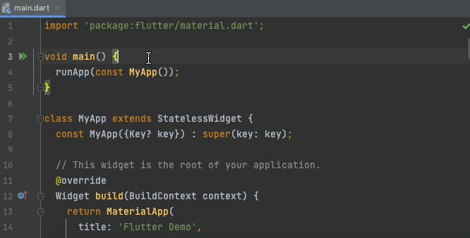

## Description

Use the [Live templates](https://www.jetbrains.com/help/idea/using-live-templates.html) feature of IDEA in JetBrains.

After installing a plugin, [the following code snippets](#code-snippets) can be used immediately.

## Code Snippets

- [General](GENERAL.md)
- [Comment](COMMENT.md)
- [Freezed](FREEZED.md)
